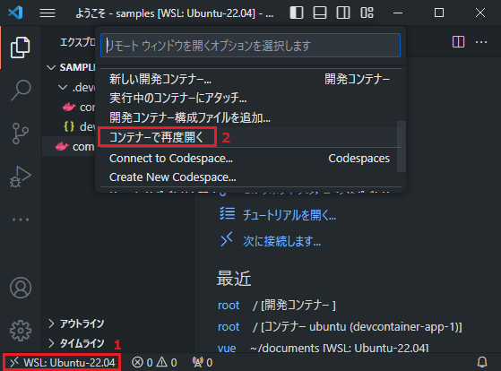

Ruby On Rails + Vue開発用コンテナ
===
VSCodeのリモートコンテナで"Ruby On Rails + Vue"の開発をするためのコンテナ環境です。

## 本コンテナ環境を使用する前提条件
本コンテナはVSCodeの「リモートコンテナ」を想定した作りになっているため、必ず下記の前提条件を守ってコンテナ環境を作成してください。

1. WSLが有効になっていること  
   -> https://learn.microsoft.com/ja-jp/windows/wsl/install
2. Rancher Desktopをインストールして、Docker環境が整備されていること  
   -> https://docs.rancherdesktop.io/getting-started/installation/
3. VSCodeをインストールすること  
   -> https://code.visualstudio.com/download
4. VSCodeからDev Containerプラグインをインストールすること  
   
5. Gitをインストールすること  
   -> https://gitforwindows.org/
6. Windows Terminalをインストールすること  
   -> https://apps.microsoft.com/detail/9N0DX20HK701

## リポジトリを取得する
```
PS> git clone https://github.com/ochipin/viterails viterails
```
※ここでは`viterails`という名前でリポジトリを所得する。

## 開発用コンテナを立ち上げる
`viterails`ディレクトリをVSCodeで開き開発用コンテナを起動する。



コンテナイメージのビルドにしばらく時間はかかるが、しばらくすると開発用コンテナが立ち上がる。

### Rails環境の構築
リモートコンテナで開発環境を立ち上げた後VSCodeのターミナルを開き、workspaceディレクトリ配下で`rails`コマンドを実行する。
```bash
$ rails new .
```

データベースを使用する場合は、以下のコマンドを実行する(DBは状況に応じて、mysqlやsqliteなど使い分けること)。
```bash
$ rails new . --force --database=postgresql
```

APIサーバを作成する場合は以下のコマンドを実行する。
```bash
$ rails new . --force --database=postgresql --api
```

### DBの設定
`rails new`コマンド実行時に生成された`config/database.yml`を次のように修正する。

```yaml
default: &default
  adapter: postgresql
  encoding: unicode
  host: <%= ENV['DB_HOST'] %>
  username: <%= ENV['DB_USER'] %>
  password: <%= ENV['DB_PASSWORD'] %>
  database: <%= ENV['DB_NAME'] %>
  # For details on connection pooling, see Rails configuration guide
  # https://guides.rubyonrails.org/configuring.html#database-pooling
  pool: <%= ENV.fetch("RAILS_MAX_THREADS") { 5 } %>
```

修正後`rake`コマンドを実行してDBを構築する。
```bash
$ rake db:create
```

### サーバ起動
`rails s`でサーバが起動する。サーバ起動後、 http://localhost:3000 へアクセスできる。
```
$ bundle install
$ rails s -p 3000 -b '0.0.0.0'
```

## Vue環境構築
Vue + TypeScript環境を`yarn`コマンドで作成する。
```
$ yarn create vite prjname --template vue-ts
```
*※prjnameに指定した名前でディレクトリが作成される。*

### パッケージのインストール
作成されたディレクトリ(ex: prjname)へ移動して`yarn`コマンドを実行すると必要な全パッケージをインストールできる。

```
$ yarn
```

### Viteを実行する
Dockerなどのコンテナで運用している場合は、開発モードのViteはブラウザでアクセスできない(Viteのセキュリティ要件に引っかかるため)。`package.json`ファイルの`"dev": "vite"`を`"dev": "vite --host"`へ修正する。
```jsonc
{
  "name": "prjname",
  "private": true,
  "version": "0.0.0",
  "type": "module",
  "scripts": {
    // --host オプションを追加すると外部からアクセスできる
    "dev": "vite --host",
    "build": "vue-tsc && vite build",
    "preview": "vite preview"
  },
  ...
}
```

ファイル修正後`yarn dev`コマンドを実行すると http://localhost:5173 から開発用のVite + Vue環境へアクセスできるようになる。

```
$ yarn dev
```

## 開発環境を終了する
左下の「開発コンテナ」をクリックし、「WSLでフォルダをもう一度開く」を選択することで開発環境を終了する。


## コンテナの操作
コンテナの状態を見る・開発環境のごみを削除する、などの操作は「タスクの実行」から行うこと。


## 開発環境を初期状態に戻す
コンテナの停止&削除、コンテナイメージの削除、既存のファイルをすべて削除することで初期状態に戻すことができる。

### 起動中のコンテナを停止する

```
$ docker compose down
```

### 開発に使用しているディレクトリを削除する

```bash
$ rm -rf database      # データベース
$ rm -rf workspace     # Rails, Vueなどのソースコード
$ rm -rf vscode-server # プラグイン管理
```

### 関連するDockerイメージを削除する

```bash
$ docker rmi viterails
$ docker rmi ubuntu:22.04
$ docker rmi postgres:16.1
```

## コンテナイメージの作り直し
下記操作でOSやRuby、Nodeなどのコンパイラのバージョンを変更することができる。

1. initialize.shを修正  
   冒頭で設定しているバージョン番号を変更することで、RubyやNode、Ubuntuなどのバージョンを変えることができる。
   ```sh
   # docker pull ubuntu で取得するイメージのバージョン
   # https://hub.docker.com/_/ubuntu からダウンロードするバージョン番号を選定する
   UBUNTU_VERSION=22.04
   # docker pull postgres で取得するイメージのバージョン
   # https://hub.docker.com/_/postgres からダウンロードするバージョン番号を選定する
   POSTGRES_VERSION=16.1
   # インストールするRubyバージョン
   RUBY_VERSION=3.2.2
   # インストールするNodeバージョン
   NODE_VERSION=20.10
   ```
2. 開発環境を初期状態に戻す
3. 開発用コンテナを立ち上げる
